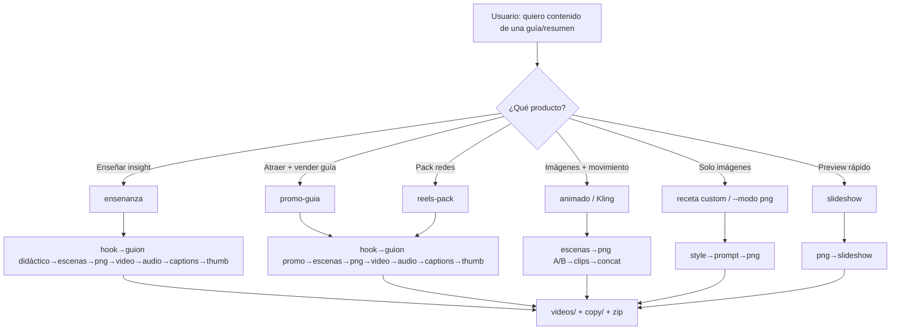

# Flujo en ramas — Creador de Contenido

## ¿Encaja lo que quieres? → **Sí**

| Quieres | Cómo encaja en este proyecto |
|---------|------------------------------|
| Imágenes con movimiento | Receta `animado` / `promo-guia` / `ensenanza`: frame inicio+fin → clip (mock o Kling) |
| Juntar imágenes con movimiento | Clips por escena → `concat` → MP4 final |
| Guion + música | `GuionAgent` + `AudioAgent` (brief + mux si pasas `audio.bed_path`) |
| Ganchos que atraigan | `HookAgent` primero |
| **Enseñar** un insight del resumen | Receta `ensenanza` + `formato: ensenanza` (estilo faceless educativo) |
| Vender una guía PDF | Receta `promo-guia` (CTA) |
| Nicho aún no definido | El **pipeline es el mismo**; cambias `guia`/tema y replicas |

```
Misma máquina de video
        │
        ├─ nicho A  → ensenanza + lote A (lección)
        ├─ nicho B  → promo-guia + lote B (venta)
        └─ nicho C  → misma receta, otro lote
```

---



## Formato `ensenanza` (referencia: Psicología Invisible / faceless)

Estructura del guion:
1. Hook con insight (no “descarga gratis”)
2. Concepto en 1 frase
3. Por qué importa
4. 2 enseñanzas concretas (desde Ideas del PDF / resumen)
5. Aplicación hoy
6. Cierre suave (guardar / volver — sin “Comenta PARETO”)

```bash
python3 creador_imagenes_main.py --slug video_pareto_psico --receta ensenanza --reset-checkpoint
```

En `lote.json`: `"receta": "ensenanza"`, `"formato": "ensenanza"`, `"fuente_guia": "…/resumen.md"`.

## Ejemplos de chat con el agente

### Enseñanza Pareto (didáctico)
> Arma un video que **enseñe** el 80/20 del resumen de Pareto, estilo canal de psicología, sin vender.

```bash
python3 creador_imagenes_main.py --slug video_pareto_psico --receta ensenanza --reset-checkpoint
```

### Promo que atrae (gancho + movimiento + audio)
> Arma promo-guia de Pareto, 2 escenas, mock. Quiero gancho fuerte y brief de música.

```bash
python3 creador_imagenes_main.py --slug video_pareto --receta promo-guia --reset-checkpoint
```

### Movimiento real (Kling)
> Igual pero Kling real.

Requiere: `MOCK_KLING=false` + `KIE_API_KEY` + `CLOUDINARY_URL`.  
Si falla → crossfade mock (no rompe).

### Guion + cama musical
En `lote.json`:
```json
"audio": { "bed_path": "assets/musica_libre.mp3", "estilo": "trap suave instrumental" }
```

### Nicho nuevo (replicar)
> Cambia solo la guía/resumen. Misma receta `ensenanza` o `promo-guia`.

---

## Qué NO hace (aún)
- No inventa el nicho por ti (tú eliges el lote)
- No genera la canción con IA (sí el brief; mux si traes el mp3)
- No toca `libros a entender` ni el PDF (solo lee el resumen si pasas `fuente_guia`)
