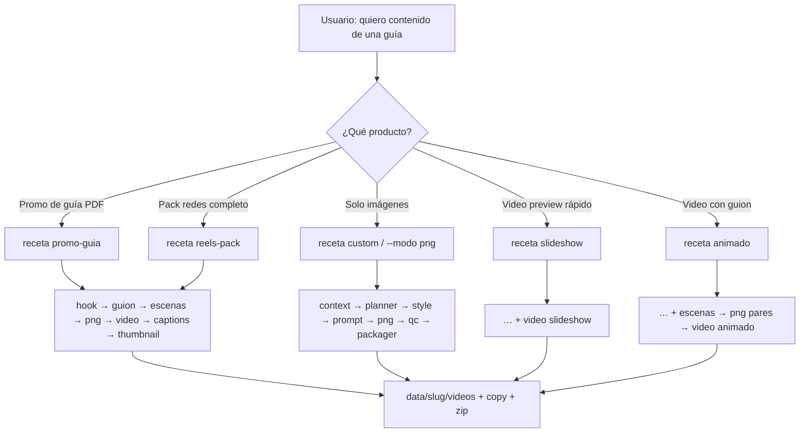

# Flujo en ramas — Creador de Contenido

Cómo se usa el agente Cursor + el CLI según lo que necesites.



## Ejemplos de cómo pedirle al agente

### Rama A — Promo de una guía (la más común)
**Dices:**
> Usa creador de contenido. Receta promo-guia. Fuente el resumen Pareto de psicopedagogas. limit_escenas 2. Mock.

**El agente hace:**
```bash
cd "creador de contenido"
python3 creador_imagenes_main.py \
  --slug video_pareto_psico \
  --receta promo-guia \
  --reset-checkpoint
```
(lote con `guia` o `fuente_guia` al `.md` — solo lectura)

**Activa:** hook → guion → escenas → PNG → video → captions → thumbnail

---

### Rama B — Ya tienes el guion escrito
**Dices:**
> Tengo este guion: "…". Armame video animado, 2 escenas, estilo papel-sketch.

**El agente hace:** lote con `"guion": "..."` + `--receta animado`

**Activa:** escenas → style → prompt → png → video *(sin hook/captions)*

---

### Rama C — Solo pack de imágenes
**Dices:**
> 3 PNG de temas enfoque, tiempo, prioridad. Estilo yordy-minimal.

**El agente hace:** `--modo png` / receta custom con `temas: [...]`

**Activa:** style → prompt → png → qc → packager

---

### Rama D — Preview barato (slideshow)
**Dices:**
> Slideshow rápido de la demo, sin Kling.

**El agente hace:** `--receta slideshow`

**Activa:** png → ffmpeg concat (gratis)

---

### Rama E — Se rompió a mitad
**Dices:**
> Reanuda el lote video_pareto_psico sin regenerar todo.

**El agente hace:**
```bash
python3 creador_imagenes_main.py --slug video_pareto_psico --receta promo-guia
# o
python3 creador_imagenes_main.py --slug video_pareto_psico --desde video
```

---

### Rama F — Copy con LLM (Paso C)
**Dices:**
> Mismo promo-guia pero con Claude en hook/guion/escenas.

**Requisito:** `MOCK_LLM=false` + `ANTHROPIC_API_KEY` en `.env`  
Si no hay key → cae a heurística (no rompe el pipeline).

---

## Qué NO hace este proyecto
- No modifica `libros a entender` ni el PDF
- No es `tiktok_pipeline` (ese es guion/shotlist aparte)
- No sube a Shopify (`proyecto landing` / `sitio-pdf`)
