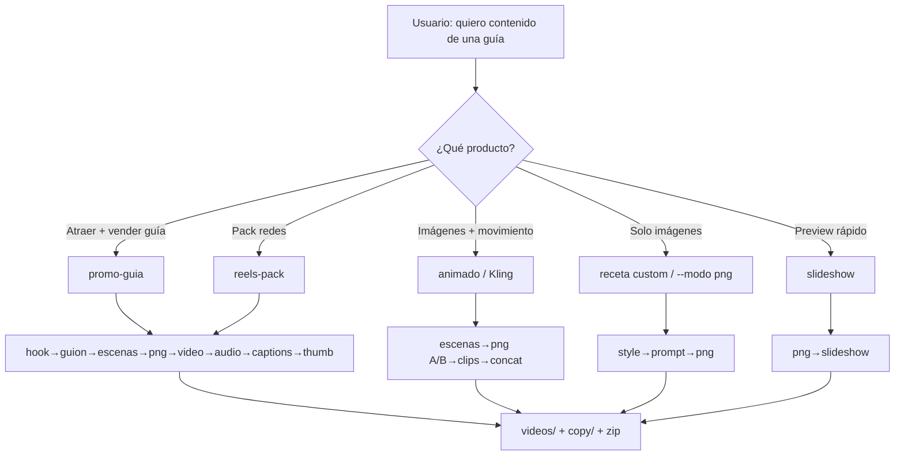

# Flujo en ramas — Creador de Contenido

## ¿Encaja lo que quieres? → **Sí**

| Quieres | Cómo encaja en este proyecto |
|---------|------------------------------|
| Imágenes con movimiento | Receta `animado` / `promo-guia`: frame inicio+fin → clip (mock crossfade o **Kling**) |
| Juntar imágenes con movimiento | Clips por escena → `concat` → MP4 final |
| Guion + música | `GuionAgent` + `AudioAgent` (brief + mux si pasas `audio.bed_path`) |
| Ganchos que atraigan | `HookAgent` primero (receta promo-guia / reels-pack) |
| Nicho aún no definido | Da igual: el **pipeline es el mismo**; solo cambias `guia`/tema y replicas |

```
Misma máquina de video
        │
        ├─ nicho A (psicopedagogas)  → promo-guia + lote A
        ├─ nicho B (abogados)        → promo-guia + lote B
        └─ nicho C (lo que sea)      → misma receta, otro lote
```

---



## Ejemplos de chat con el agente

### Promo que atrae (gancho + movimiento + audio)
> Arma promo-guia de Pareto, 2 escenas, mock. Quiero gancho fuerte y brief de música.

```bash
python3 creador_imagenes_main.py --slug video_pareto --receta promo-guia --reset-checkpoint
```

### Movimiento real (Kling)
> Igual pero Kling real.

Requiere: `MOCK_KLING=false` + `KIE_API_KEY` + `CLOUDINARY_URL`.  
Si falla → crossfade mock (no rompe).

### Guion + cama musical
En `lote.json`:
```json
"audio": { "bed_path": "assets/musica_libre.mp3", "estilo": "trap suave instrumental" }
```

### Nicho nuevo (replicar)
> Cambia solo la guía a «Hábitos para enfermeras». Misma receta promo-guia.

---

## Qué NO hace (aún)
- No inventa el nicho por ti (tú eliges el lote)
- No genera la canción con IA (sí el brief; mux si traes el mp3)
- No toca `libros a entender` ni el PDF
