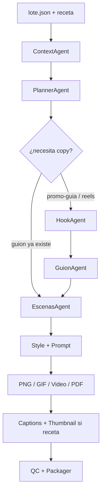

# Creador de Contenido

Proyecto en `creador de contenido`.

Genera **PNG · GIF · Video · PDF** y un **sistema de video por recetas**: agentes y skills se activan según lo que necesite el video.

## Comandos

```bash
cd "creador de contenido"
pip install -r requirements.txt

# Listar recetas (qué agentes/skills activa cada una)
python3 creador_imagenes_main.py --listar-recetas

# Promo de una guía PDF (hook → guion → escenas → video → captions → thumb)
python3 creador_imagenes_main.py --slug demo_promo_guia --receta promo-guia --reset-checkpoint

# Solo video animado desde guion
python3 creador_imagenes_main.py --slug demo_animado --receta animado

# Slideshow rápido
python3 creador_imagenes_main.py --slug demo_slideshow --receta slideshow

# Modos clásicos
python3 creador_imagenes_main.py --slug demo_lote --modo png
python3 creador_imagenes_main.py --slug demo_full --modo all

# Reanudar (Paso B): sin --reset-checkpoint continúa tras el último paso OK
# o fuerza punto de partida:
python3 creador_imagenes_main.py --slug demo_lote --modo png --desde png
```

## Recetas → agentes / skills

| Receta | Skills | Agentes activos |
|--------|--------|-----------------|
| `slideshow` | guion-a-video | context → planner → style → prompt → png → video → qc → packager |
| `animado` | guion-a-video | + escenas (requiere guion) |
| `promo-guia` | hooks-redes, guion-a-video, captions-redes, thumbnail-social | + hook → guion → escenas → … → captions → thumbnail |
| `reels-pack` | mismas 4 | pack redes completo |
| `custom` | — | según `salidas` / `copy` del lote |

Definición: `meta/recetas.json`. Plan runtime por lote: `data/{slug}/meta/plan_runtime.json`.

## Flujo (mermaid)



## Entrada lote.json (promo guía)

```json
{
  "titulo": "Mi guía",
  "receta": "promo-guia",
  "guia": {
    "titulo": "El principio de Pareto",
    "promesa": "enfocarte en el 20% que importa",
    "ideas": ["idea 1", "idea 2", "idea 3"],
    "cta": "Comenta PARETO"
  },
  "fuente_guia": "ruta/opcional/al/resumen.md",
  "video": { "modo": "animado", "limit_escenas": 2 }
}
```

## Salida

```
data/{slug}/
├── imagenes/
├── videos/          ← MP4 + clips/
├── copy/            ← guion.md, captions.md, thumbnail.png
├── meta/
│   ├── plan_runtime.json
│   ├── hooks.json
│   ├── guion.json
│   ├── escenas.json
│   └── …
└── output/{slug}_contenido.zip
```

## Video — modos de render

| Modo | Qué hace | Costo |
|------|----------|-------|
| `slideshow` | PNGs → ffmpeg concat | Gratis |
| `animado` | Guion → escenas → frame A+B → clip → MP4 | Mock gratis / Kling ~pago |

## Arquitectura

```
src/pipeline.py      → orquestador + AGENTS dict
src/recipes.py       → resolve_recipe / infer_receta
src/agents/          → context, planner, hook, guion, escenas, style, prompt, qc, packager, captions, thumbnail
imagenes|gifs|videos|pdf/ → módulos de salida
meta/recetas.json    → catálogo de recetas
```

## Pendiente V1

- [x] **A** Limpieza: GenerateAgent muerto eliminado; `meta/plan.json` alineado con runtime
- [x] **B** Checkpoint que reanuda (`last_completed_slug` + `--desde` / auto-resume)
- [x] **C** LLM opcional en hook/guion/escenas (`MOCK_LLM=false` + `ANTHROPIC_API_KEY`; si no → heurística)
- [x] **D** IA real imágenes (`MOCK_GENERATE=false` + OpenAI/Replicate; si falla → placeholder)
- [x] **E** Kling real (`MOCK_KLING=false` + `KIE_API_KEY` + Cloudinary; si falla → crossfade mock)
- [x] Audio brief + mux opcional (`audio.bed_path`) en promo-guia / reels-pack
- [ ] Conexión directa a salida de `libros a entender` vía path `fuente_guia`

## Video + audio (Paso E)

```bash
# Mock motion (default) — junta frame inicio/fin con crossfade
MOCK_KLING=true python3 creador_imagenes_main.py --slug demo_promo_guia --receta promo-guia

# Kling real
# .env: MOCK_KLING=false  KIE_API_KEY=...  CLOUDINARY_URL=cloudinary://...
MOCK_KLING=false python3 creador_imagenes_main.py --slug demo_promo_guia --receta promo-guia --reset-checkpoint

# Cama musical (opcional en lote.json):
# "audio": { "bed_path": "ruta/a/musica.mp3" }
```
