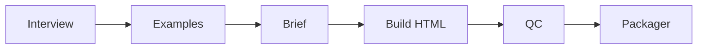

# Creador de Landings

Pipeline cursorprime: **entrevista → ejemplos → landing HTML** en segundos.

## Flujo



## CLI

```bash
cd creador-de-landings

# Demo colección (Vértice Pro)
python3 landings_main.py demo --ejemplo tienda

# Demo 1 producto (Norte Claro)
python3 landings_main.py generar --slug demo-simple --ejemplo tienda --reset-checkpoint

# Entrevista / letras
python3 landings_main.py preguntas
python3 landings_main.py responder --slug mi-marca --letras "todo A" --generar

# Reintento por paso
python3 landings_main.py generar --slug demo-cliente --solo brief --reset-checkpoint

# Aprendizaje con efecto real (ej. ocultar newsletter)
python3 landings_main.py aprender --mensaje "quitar newsletter" --cambio "ocultar_newsletter"
```

Flags reales: `--solo interview|examples|brief|build|qc|packager` (no `--solo-interview`).

## Catálogo

- Default: `meta/catalogo_default.json` (libros × roles)
- Por marca: `data/{slug}/inputs/catalogo.json`

## Aprendizaje

`aprender` escribe en `logs/mejoras.json` y aplica **efectos** al brief que el HTML respeta:

- `ocultar_newsletter` / `ocultar_faq`
- `forzar_cta` (vía `cta: ...` en el mensaje)

## Templates

| Estilo | Archivo |
|--------|---------|
| `tienda` | `src/templates/tienda.py` |
| `editorial` / `mockup` / `oferta` | `src/templates/html_builder.py` |
| helpers | `src/templates/common.py` |

## Salida

```
data/{slug}/output/
├── preview.html
├── brief.md
├── ejemplos.md
├── URL-PUBLICA.txt
└── manifest.json
```

## Entrega

Mostrar **solo URL pública** del preview. No pegar HTML. No screenshots.

## MVP / límites

- Botones de compra son `href="#"` (sin checkout real).
- Testimonios inventados prohibidos → `[PENDIENTE]`.
