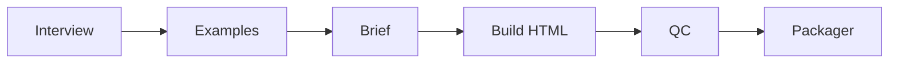

# Creador de Landings

Pipeline cursorprime: **entrevista → ejemplos → landing HTML** en segundos.

## Flujo



## CLI

```bash
cd creador-de-landings

# Demo como cliente (Vértice Pro / PDF por rol)
python3 landings_main.py demo

# Entrevista interactiva
python3 landings_main.py entrevista --slug mi-marca

# Con respuestas ya guardadas
python3 landings_main.py generar --slug mi-marca

# Solo ejemplos a partir de respuestas
python3 landings_main.py ejemplos --slug mi-marca
```

## Entrada

- Preguntas en `meta/preguntas.json`
- Respuestas: `data/{slug}/inputs/respuestas.json`
- Estilo elegido: `ejemplo` = `editorial` | `mockup` | `oferta`

## Salida

```
data/{slug}/output/
├── preview.html      # landing lista
├── brief.md          # resumen del brief
├── ejemplos.md       # 3 estilos propuestos
└── manifest.json
```

## MVP / V1 / Futuro

| Fase | Qué |
|------|-----|
| **MVP** | Entrevista + 3 ejemplos + HTML estático (3 plantillas) + demo cliente |
| **V1** | Imagen hero IA / Unsplash, export Shopify sections, A/B headlines |
| **Futuro** | Multi-página, i18n, conectar creador de contenido para assets |

## Relación con otros proyectos

| Proyecto | Rol |
|----------|-----|
| `landing-lanzamiento` (skill) | Solo copy/brief markdown |
| **creador-de-landings** | Genera HTML real |
| `vertice-pro-preview` | Referencia visual (imagen 6 / hero) |
| `sitio-pdf` | Tienda PDF + Shopify zip |
