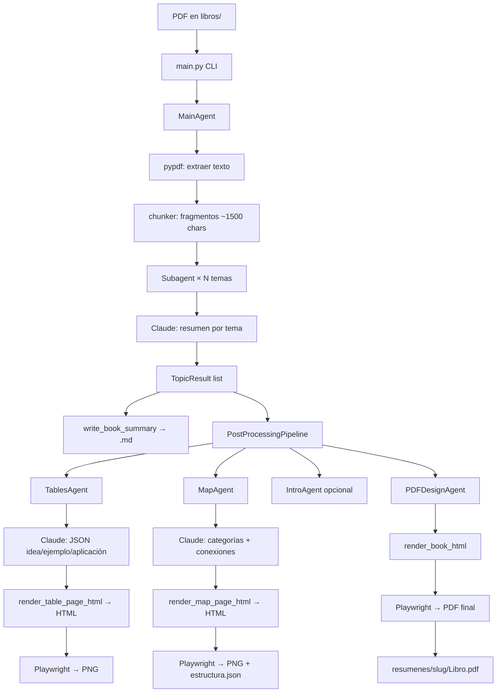

# Contexto del proyecto — Libros a Entender

Documento para compartir con Claude y mejorar el diseño visual del PDF.

---

## 1. Qué hace el sistema

Genera **resúmenes PDF editoriales** de libros a partir de un PDF fuente. El lector objetivo es alguien de 22–35 años que quiere claridad rápida, no un resumen académico. La voz es **Yordy**: directa, primera persona, frases cortas, sin jerga de autoayuda.

**Producto final:** un PDF con portada, mapa conceptual, un capítulo por tema (resumen en prosa) y una página de tarjeta visual por tema (idea clave / ejemplo / aplicación).

---

## 2. Estructura de carpetas

```
libros a entender/
├── main.py                    # CLI — punto de entrada
├── requirements.txt
├── .env                       # API keys (ANTHROPIC, UNSPLASH)
├── libros/                    # PDFs fuente
│   └── {Libro}.pdf
├── resumenes/{slug}/          # Salida por libro
│   ├── {Libro}.md             # Resumen markdown
│   ├── {Libro}.pdf            # PDF final
│   ├── meta/
│   │   ├── introduccion.txt
│   │   ├── quality_report.json
│   │   └── .checkpoint.json
│   ├── mapa/
│   │   ├── mapa.html          # Mapa standalone (Playwright source)
│   │   ├── mapa.png           # Mapa renderizado
│   │   └── estructura.json    # Categorías + conexiones (usado en PDF)
│   ├── tablas/
│   │   ├── index.json
│   │   ├── {tema_slug}.html   # Tarjeta por tema
│   │   └── {tema_slug}.png
│   ├── imagenes/              # Unsplash (opcional)
│   │   └── {tema_slug}.jpg
│   └── html/
│       └── {Libro}.html       # HTML ensamblado del libro completo
├── logs/
│   ├── mejoras.json           # Prompts mejorados entre libros
│   └── errores.json
└── src/
    ├── main_agent.py          # Orquestador principal
    ├── subagent.py            # Resumen por tema (Claude)
    ├── llm.py                 # Cliente Anthropic
    ├── html_renderer.py       # ★ TODO el CSS/HTML visual + PDF
    ├── output_paths.py        # Rutas centralizadas
    ├── pipeline.py            # Adaptador al pipeline de agentes
    ├── output.py              # Genera .md
    ├── md_loader.py           # Lee .md existente
    ├── md_pdf_export.py       # Fallback PDF (ReportLab)
    └── agents/
        ├── pipeline.py        # Orquesta tablas → mapa → imágenes → PDF
        ├── tables_agent.py    # Tarjetas con voz Yordy
        ├── map_agent.py       # Mapa conceptual
        ├── intro_agent.py     # Introducción del PDF
        ├── pdf_design_agent.py# Ensambla PDF final
        ├── images_agent.py    # Unsplash
        ├── learning_agent.py  # Mejora prompts
        └── book_package.py    # Dataclass con artefactos
```

---

## 3. Tecnologías

| Capa | Tecnología |
|------|------------|
| Lenguaje | Python 3.9+ |
| LLM | **Anthropic Claude** (`claude-sonnet-4-5`) vía `anthropic` SDK |
| Lectura PDF | `pypdf` |
| Render visual | **HTML + CSS** generado en Python |
| PDF principal | **Playwright** (Chromium headless) — `page.pdf()` |
| PNG (tablas/mapa) | **Playwright** — `page.screenshot()` |
| PDF fallback | **ReportLab** (si Playwright falla) |
| Imágenes | Unsplash API (opcional) |
| Fuentes | Google Fonts: **Literata** (serif) + **Source Sans 3** (sans) |
| Config | `python-dotenv` |

**Nota:** Napkin ya no se usa. Todo lo visual pasa por `html_renderer.py` + Playwright.

---

## 4. Cómo se genera el PDF

### Librería principal: Playwright + Chromium

```
BookPackage (datos)
    ↓
render_book_html()          → HTML string con EDITORIAL_CSS embebido
    ↓
write_html()                → resumenes/{slug}/html/{Libro}.html
    ↓
html_to_pdf()               → Playwright abre el HTML local
    ↓
page.pdf(format="A4", print_background=True)
    ↓
resumenes/{slug}/{Libro}.pdf
```

### Código de conversión (`src/html_renderer.py`)

```python
def html_to_pdf(html_path: Path, pdf_path: Path) -> Path:
    with sync_playwright() as p:
        browser = p.chromium.launch()
        page = browser.new_page()
        page.goto(html_path.as_uri(), wait_until="networkidle")
        page.pdf(
            path=str(pdf_path),
            format="A4",
            print_background=True,
            prefer_css_page_size=True,
            margin={"top": "0", "right": "0", "bottom": "0", "left": "0"},
            display_header_footer=False,
        )
        browser.close()
```

### Estructura de páginas del PDF

| Orden | Sección | Función HTML | `page-break` |
|-------|---------|--------------|--------------|
| 1 | Portada | `render_cover_fragment()` | `page-break-after: always` |
| 2 | Mapa conceptual | `render_map_fragment()` desde `estructura.json` | sí |
| 3+ | Por cada tema: | | |
| | → Resumen del tema | `render_topic_fragment()` | sí |
| | → Tarjeta visual | `render_table_pdf_page()` (HTML embebido, no PNG) | sí |

**Importante:** Las tablas en el PDF son **HTML directo** (variante iconos), no imágenes PNG. Los PNG en `tablas/` son para el `.md` y caché.

### Fallback

Si Playwright falla → `md_pdf_export.build_pdf_from_markdown()` con **ReportLab** (texto plano + imágenes PNG).

---

## 5. Flujo de información (input → PDF)



### Modos CLI parciales

```bash
# Pipeline completo (flags ANTES del nombre del libro)
python main.py --slug pareto --sin-confirmacion "Libro" "Tema 1" "Tema 2" ...

# Solo regenerar partes (requiere .md existente)
python main.py --solo-tablas --slug pareto --sin-confirmacion "Libro"
python main.py --solo-mapa   --slug pareto --sin-confirmacion "Libro"
python main.py --solo-pdf    --slug pareto --sin-confirmacion "Libro"
```

---

## 6. Sistema de diseño visual actual

### Tipografía (`EDITORIAL_CSS`)

```css
--serif: 'Literata', Georgia, serif;      /* cuerpo, resúmenes */
--sans:  'Source Sans 3', Arial, sans-serif; /* labels, kickers */
--ink:   #1a1a1a;
--accent: #2c5282;   /* azul editorial — portada, kickers */
--paper: #fafaf8;
```

### Portada (`.cover`)

- Barra azul superior (`cover-rule`, 42×4px, `#2c5282`)
- Label: "Resumen personal" (sans, uppercase, letter-spacing)
- Título: Literata 26pt bold
- Autor: Source Sans 14pt, color accent
- Meta: fecha, número de temas, "Por Yordy"
- Intro: itálica, borde izquierdo azul claro (`#dbeafe`)

### Página de tema (`.topic`)

- Kicker: "Tema 01" (sans, accent)
- Título del tema: serif 18pt
- Subtítulo: "Lo que aprendí (Yordy)"
- Cuerpo: texto justificado, Literata 11pt

### Tarjetas — variante ICONOS (activa en PDF)

Tres bloques por tema con emojis como badge circular:

| Bloque | Icono | Color badge | Fondo tarjeta |
|--------|-------|-------------|---------------|
| Idea clave | 💡 | `#26A69A` teal | gradiente `#e0f7f4 → white` |
| Ejemplo práctico | 🔧 | `#FF6B35` naranja | gris + borde izquierdo teal |
| Aplicación | 🎯 | `#37474F` gris oscuro | gradiente `#fff3e6 → white` |

Clases CSS: `.table-page-icons`, `.tbl-editorial-card`, `.tbl-editorial-badge`, `.page-icons`

### Mapa conceptual — layout actual (grid 2×2)

**Paleta por categoría** (`CATEGORY_COLORS_TREE`):

```python
{"bg": "#085041", "light": "#1D9E75", "text": "#9FE1CB", "tema_bg": "#E1F5EE", "tema_text": "#085041"},  # verde
{"bg": "#3C3489", "light": "#7F77DD", "text": "#CECBF6", "tema_bg": "#EEEDFE", "tema_text": "#26215C"},  # violeta
{"bg": "#712B13", "light": "#D85A30", "text": "#F5C4B3", "tema_bg": "#FAECE7", "tema_text": "#4A1B0C"},  # naranja
{"bg": "#72243E", "light": "#D4537E", "text": "#F4C0D1", "tema_bg": "#FBEAF0", "tema_text": "#4B1528"},  # rosa
{"bg": "#0C447C", "light": "#378ADD", "text": "#B5D4F4", "tema_bg": "#E6F1FB", "tema_text": "#042C53"},  # azul
{"bg": "#3B6D11", "light": "#639922", "text": "#C0DD97", "tema_bg": "#EAF3DE", "tema_text": "#173404"},  # verde oliva
```

**Estructura visual:**

```
         [Nodo raíz negro — título del libro]
                    |
              [SVG conectores]
         ┌──────────┴──────────┐
    [Cat 1 píldora]      [Cat 2 píldora]
         |                    |
    Tema Tema Tema       Tema Tema
    (píldoras pastel con link word encima)
         ┌──────────┴──────────┐
    [Cat 3]              [Cat 4]
    ...
```

- Categorías en filas de 2 (`flex-direction: row`)
- Cada categoría: píldora oscura arriba → línea vertical → temas en fila
- Link words: primeras 3 palabras de la relación entre temas (itálica, gris)
- Conectores: SVG fijo desde nodo central (tronco + horizontal + 2 bajadas al 25% y 75%)
- Mucho CSS inline en `render_map_fragment()` (no usa `EDITORIAL_CSS` para el mapa)

---

## 7. Agentes y responsabilidades

| Agente | Archivo | Input | Output | Visual |
|--------|---------|-------|--------|--------|
| MainAgent | `main_agent.py` | PDF + temas | TopicResult[] | — |
| Subagent | `subagent.py` | chunks + tema | resumen + fragmentos | — |
| TablesAgent | `tables_agent.py` | TopicResult | TopicTable + PNG | `render_table_page_html()` |
| MapAgent | `map_agent.py` | lista temas | PNG + estructura.json | `render_map_page_html()` |
| IntroAgent | `intro_agent.py` | libro + temas | texto intro | — |
| PDFDesignAgent | `pdf_design_agent.py` | BookPackage | PDF | `render_book_html()` |
| ImagesAgent | `images_agent.py` | temas | JPG Unsplash | — |

---

## 8. Código de archivos principales

### 8.1 `BookPackage` — contenedor de artefactos

```python
# src/agents/book_package.py
@dataclass
class TopicTable:
    tema: str
    idea_clave: str
    ejemplo_practico: str
    aplicacion_vida_real: str
    image_path: Optional[Path] = None

@dataclass
class BookPackage:
    libro_nombre: str
    libro_slug: str
    output_dir: Path
    resultados: list          # list[TopicResult]
    tablas: list              # list[TopicTable]
    mapa_path: Optional[Path] = None
    imagenes: dict = field(default_factory=dict)
    introduccion: str = ""
    fecha: Optional[datetime] = None
    pdf_path: Optional[Path] = None
```

### 8.2 `PDFDesignAgent.run()` — ensambla el PDF

```python
# src/agents/pdf_design_agent.py
def run(self, package: BookPackage) -> Path:
    package.introduccion = load_or_create_intro(...)  # IntroAgent si hay API key

    book_html = render_book_html(package, voz_nombre="Yordy", html_dir=html_dir)
    write_html(html_path, book_html)

    html_string_to_pdf(book_html, html_path, pdf_path)  # Playwright
    package.pdf_path = pdf_path
    return pdf_path
```

### 8.3 `render_book_html()` — estructura del documento

```python
# src/html_renderer.py
def render_book_html(package, *, voz_nombre="Yordy", html_dir=None) -> str:
    parts = [render_cover_fragment(...)]

    # Mapa: HTML desde estructura.json (preferido) o PNG fallback
    mapa_data = load_map_estructura_data(package.output_dir)
    if mapa_data:
        parts.append(render_map_fragment(temas, categorias, conexiones, libro))
    elif package.mapa_path:
        parts.append(render_map_image_fragment(image_rel=...))

    for resultado in package.resultados:
        parts.append(render_topic_fragment(resultado, index=idx, ...))
        if tabla := tablas_map.get(resultado.tema):
            parts.append(render_table_pdf_page(tabla, libro_nombre))  # HTML iconos

    return wrap_html("".join(parts), title=libro_nombre)
    # wrap_html inyecta EDITORIAL_CSS completo en <head>
```

### 8.4 Tarjeta en PDF — variante iconos

```python
# src/html_renderer.py
def _render_table_editorial(tabla, *, variant: str) -> str:
    cards = [
        ("Idea clave", tabla.idea_clave, "idea", "💡"),
        ("Ejemplo práctico", tabla.ejemplo_practico, "ejemplo", "🔧"),
        ("Aplicación en la vida real", tabla.aplicacion_vida_real, "aplicacion", "🎯"),
    ]
    # Genera .tbl-editorial-card con .tbl-editorial-badge (emoji) + texto

def render_table_pdf_page(tabla, libro_nombre) -> str:
    return f"""
<section class="table-page-icons page-icons avoid-break">
  <article class="standalone-table-page">
    <h1>{tema}</h1>
    <p class="book-ref">{libro}</p>
    {_render_table_icons(tabla)}
  </article>
</section>"""
```

### 8.5 Mapa — `render_map_fragment()` (resumen)

```python
# src/html_renderer.py — función principal del mapa (~130 líneas)
def render_map_fragment(temas, categorias, conexiones, libro_nombre) -> str:
    # 1. Agrupa temas por categoría, asigna CATEGORY_COLORS_TREE
    # 2. link_words desde conexiones (3 primeras palabras de la relación)
    # 3. cat_block(): píldora categoría + línea + temas en fila
    # 4. Filas de 2 categorías lado a lado
    # 5. Retorna HTML con:
    #    - <style> embebido (.map-section, .map-kicker, etc.)
    #    - Nodo raíz negro centrado
    #    - SVG conectores (tronco + horizontal + 2 verticales)
    #    - Grid 2×2 de categorías
```

### 8.6 `MapAgent.run()` — genera mapa

```python
# src/agents/map_agent.py
TEMAS_EXCLUIDOS = {"resumen", "summary", "introducción", "introduction", "índice"}

def run(self, temas, libro_nombre, output_dir, *, force=False):
    temas_filtrados = _filtrar_temas_mapa(temas)
    categorias, conexiones = self._obtener_estructura(temas_filtrados, libro)  # Claude JSON
    # Guarda mapa/estructura.json
    content = render_map_page_html(temas_filtrados, categorias, conexiones, libro)
    write_html(mapa/mapa.html, content)
    html_to_png(mapa.html, mapa.png)  # Playwright screenshot
```

### 8.7 `TablesAgent` — genera tarjetas

```python
# src/agents/tables_agent.py
ICONOS_VARIANT_INDEX = 2  # siempre diseño iconos

def run(self, resultados, libro_nombre, output_dir, *, force=False):
    for resultado in resultados:
        tabla = self._generar_tabla(resultado, libro, temas_anteriores=...)  # Claude JSON
        tabla.image_path = self._render_html_png(tabla, ...)  # Playwright → PNG
        # HTML: render_table_page_html(tabla, variant_index=2)
```

---

## 9. Archivo visual central: `src/html_renderer.py`

**~1200 líneas.** Contiene TODO el diseño. Funciones clave para mejorar visual:

| Función | Línea aprox. | Qué controla |
|---------|--------------|--------------|
| `EDITORIAL_CSS` | ~23–700 | CSS global: portada, temas, tablas, mapa legacy |
| `_editorial_card()` | ~727 | Estructura HTML de cada bloque de tarjeta |
| Variante iconos CSS | ~511–586 | Colores y layout tarjetas en PDF |
| `render_cover_fragment()` | ~1008 | Portada |
| `render_topic_fragment()` | ~1033 | Página de resumen por tema |
| `render_table_pdf_page()` | ~1051 | Página de tarjeta en PDF |
| `CATEGORY_COLORS_TREE` | ~832 | Paleta del mapa |
| `render_map_fragment()` | ~842 | **Todo el HTML/CSS del mapa** |
| `render_book_html()` | ~1063 | Ensamblaje del documento |
| `html_to_pdf()` | ~1179 | Conversión Playwright → PDF |

---

## 10. Datos de ejemplo (libro Pareto)

**Ruta:** `resumenes/pareto/`

- 10 temas, ~22 páginas PDF
- Mapa: 3–4 categorías en grid 2×2
- Tablas: 10 tarjetas con iconos 💡🔧🎯
- Intro generada por IA con voz Yordy

**`mapa/estructura.json` (extracto):**

```json
{
  "libro_nombre": "El principio de Pareto - Antoine Delers",
  "temas": ["Principio 80/20", "Ley de Pareto", "Productividad personal", ...],
  "categorias": {
    "Principio 80/20": "Concepto central",
    "Priorización de tareas": "Aplicación práctica"
  },
  "conexiones": [
    {"desde": "Principio 80/20", "hasta": "Ley de Pareto", "relacion": "son el mismo concepto..."}
  ]
}
```

---

## 11. Áreas abiertas para mejorar diseño visual

1. **Mapa conceptual** — CSS mayormente inline en `render_map_fragment()`; mezcla estilos embebidos con `EDITORIAL_CSS`. Conectores SVG básicos (`#aaa`). Grid 2×2 puede quedar apretado con 4+ categorías.

2. **Coherencia de paleta** — Portada usa azul editorial (`#2c5282`); tablas usan teal/naranja/gris; mapa usa paleta propia `CATEGORY_COLORS_TREE`. No hay design tokens unificados.

3. **Tipografía del mapa** — Usa `Helvetica Neue` inline, no las fuentes Literata/Source Sans del resto del PDF.

4. **Tablas en PDF vs PNG** — El PDF embebe HTML (vectorial); los PNG standalone pueden verse distintos.

5. **Portada** — Minimalista (barra + texto). Sin imagen, sin gradiente, sin jerarquía visual fuerte.

6. **Páginas de tema** — Solo texto justificado. Sin elementos visuales, iconos ni separadores entre temas.

---

## 12. Comandos para regenerar y probar cambios visuales

```bash
cd "libros a entender"
.venv/bin/playwright install chromium   # primera vez

# Regenerar solo mapa (rápido, ~15s)
.venv/bin/python main.py --solo-mapa --slug pareto --sin-confirmacion \
  "El principio de Pareto - Antoine Delers"

# Regenerar solo tablas (~2 min, 10 llamadas Claude)
.venv/bin/python main.py --solo-tablas --slug pareto --sin-confirmacion \
  "El principio de Pareto - Antoine Delers"

# Regenerar solo PDF (lee .md + estructura.json + tablas existentes, ~10s)
.venv/bin/python main.py --solo-pdf --slug pareto --sin-confirmacion \
  "El principio de Pareto - Antoine Delers"
```

**Archivos a abrir para preview visual sin PDF:**
- `resumenes/pareto/mapa/mapa.html` — mapa standalone
- `resumenes/pareto/tablas/{tema}.html` — tarjeta individual
- `resumenes/pareto/html/El principio de Pareto - Antoine Delers.html` — libro completo

---

## 13. Variables de entorno

```env
ANTHROPIC_API_KEY=sk-ant-...
UNSPLASH_ACCESS_KEY=...        # opcional
```

---

*Generado para contexto de diseño visual. Proyecto: Libros a Entender — voz Yordy.*
