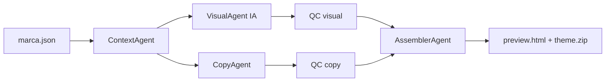

# Pipeline Sitio PDF — Vértice Pro (piloto)

Genera **tienda profesional** para guías PDF: marca → imágenes IA → copy → tema Shopify + preview HTML.

## Alcance piloto

- **Una marca:** Vértice Pro
- **Un producto de prueba:** Pareto psicopedagogas (slug `pareto`)
- **Salida:** carpeta `output/` con imágenes, copy, `preview.html`, `vertice-pro-theme.zip`

## Flujo



## Pasos CLI

| Paso | Agente | Output |
|------|--------|--------|
| 1 | Context | `meta/context.json` |
| 2 | Visual | `output/assets/` PNG |
| 3 | Copy | `output/copy/` |
| 4 | QC | `meta/qc_report.json` |
| 5 | Assembler | `output/preview.html`, `output/theme.zip` |

## Comandos (cuando esté listo)

```bash
cd sitio-pdf
python3 sitio_pdf_main.py generar --slug vertice-pro --producto pareto
python3 sitio_pdf_main.py generar --slug vertice-pro --mock   # sin API imagen
```

## Decisiones pendientes (usuario)

Ver `meta/DECISIONES.md` — el pipeline no corre con IA real hasta confirmar opciones.

## Integraciones

| Sistema | Uso |
|---------|-----|
| `libros a entender/kdp/` | Copy producto, portada existente |
| `creador de contenido` | Generación PNG (hero, iconos) |
| `clientes/vertice-pro/` | Marca + entregables Shopify |

## Definition of Done (piloto)

- [ ] `--help` funciona
- [ ] `--mock` genera preview con placeholders coherentes
- [ ] Con API: hero + 3 iconos + portada producto en preview
- [ ] theme.zip importable en Shopify
- [ ] QC rechaza brief incompleto
